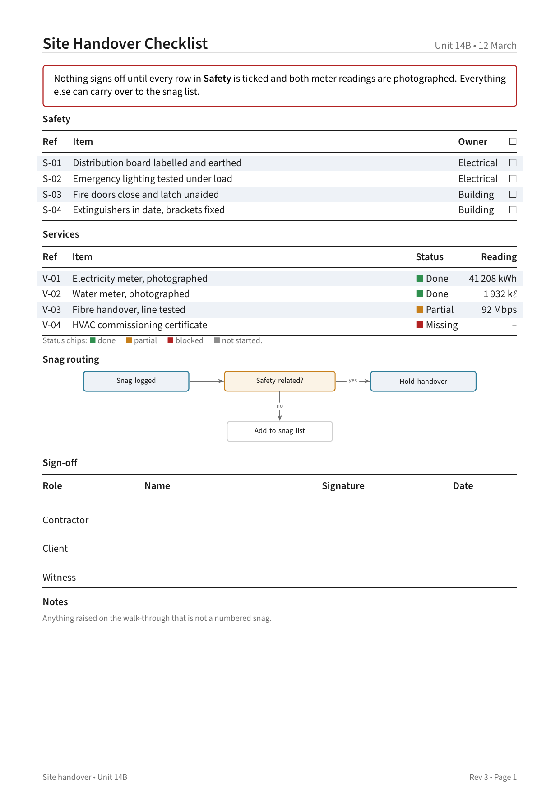
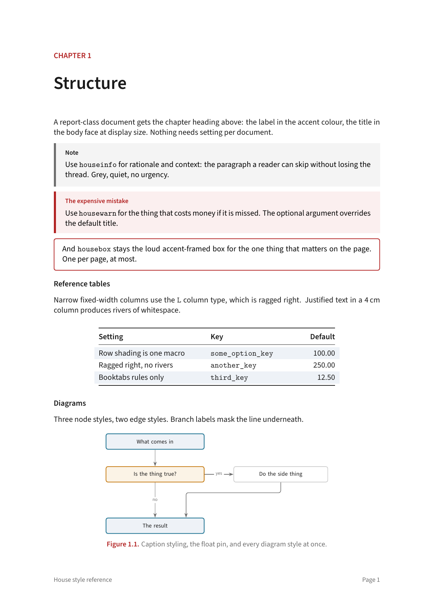
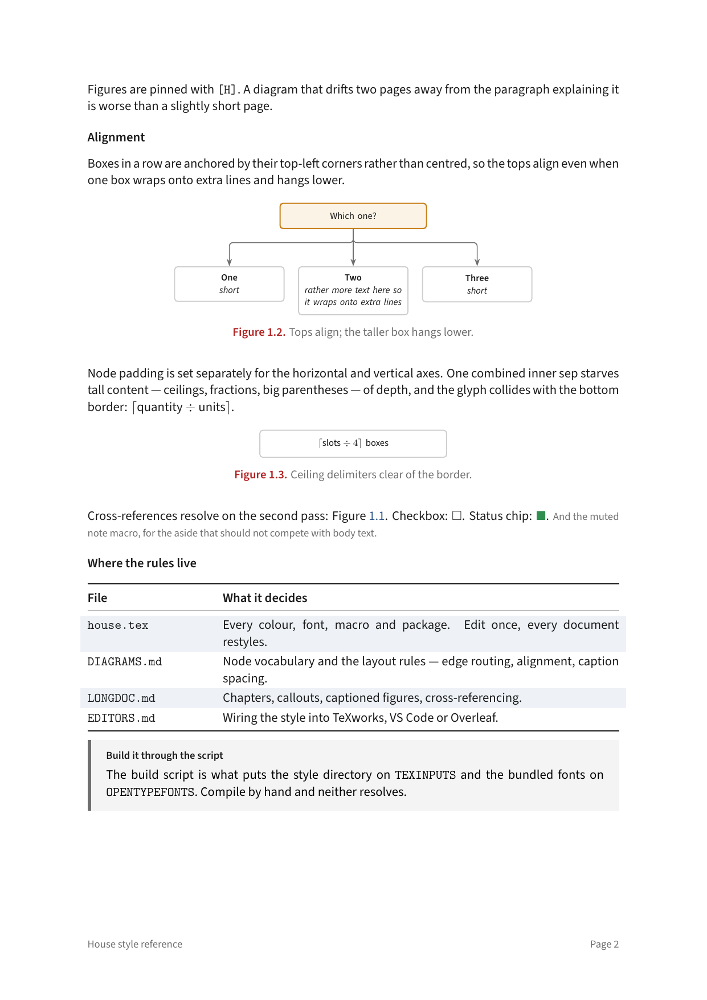
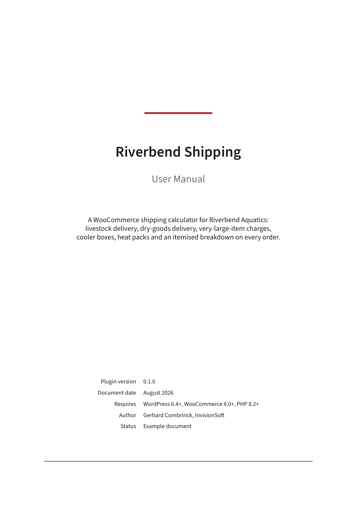
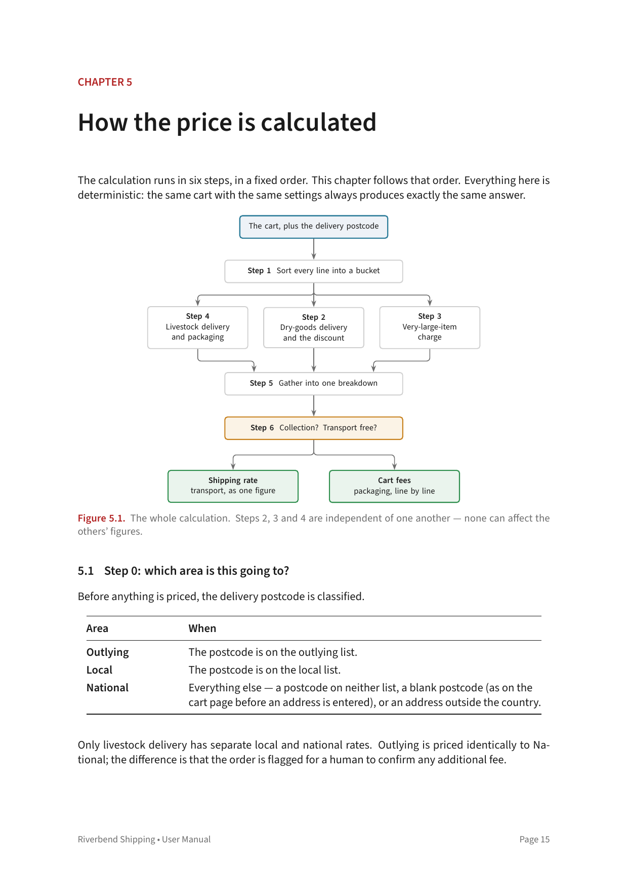
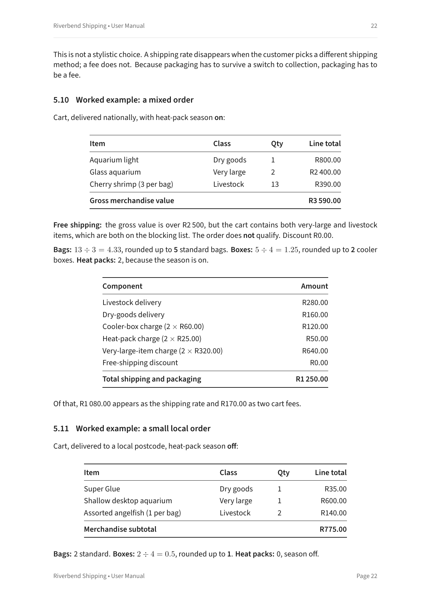

# claude-skills

Claude Code skills, packaged as a plugin marketplace.

## Install

```bash
claude
```

Then, inside Claude Code:

```
/plugin marketplace add GerhardCombrinck/claude-skills
/plugin install gc-skills@invisionsoft
```

Restart Claude Code and the skill is live — it appears in the skill list as
`gc-skills:latex`. Claude picks it up automatically when a task calls for a PDF; you can
also invoke it by name with `/gc-skills:latex`.

To update later, refresh the marketplace and then the plugin:

```
/plugin marketplace update invisionsoft
```

```
/plugin update gc-skills
```

## What it looks like

Three example documents live in [`examples/`](examples/), built with nothing but the
house style. Every screenshot below opens the PDF it came from, hosted at
[gerhardcombrinck.github.io/claude-skills](https://gerhardcombrinck.github.io/claude-skills/).

<p align="center">
  <a href="https://gerhardcombrinck.github.io/claude-skills/examples/onepager.pdf"></a>
  <a href="https://gerhardcombrinck.github.io/claude-skills/examples/report.pdf"></a>
  <a href="https://gerhardcombrinck.github.io/claude-skills/examples/report.pdf"></a>
</p>

**[onepager.pdf](https://gerhardcombrinck.github.io/claude-skills/examples/onepager.pdf)** (1 page) ·
**[report.pdf](https://gerhardcombrinck.github.io/claude-skills/examples/report.pdf)** (2 pages)

Left: [`examples/onepager.tex`](examples/onepager.tex) — article class, one page.
Middle and right: [`examples/report.tex`](examples/report.tex) — report class, chapters,
callouts, captioned figures, cross-references.

### A full-length manual

[`examples/manual/shipping-manual.tex`](examples/manual/shipping-manual.tex) is a
38-page software manual in the same house style: title page, table of contents, ten
chapters and three appendices (the last of them a glossary), seven TikZ diagrams,
22 `longtable` reference tables that break across pages, five code listings and
resolved cross-references throughout.

<p align="center">
  <a href="https://gerhardcombrinck.github.io/claude-skills/examples/manual/shipping-manual.pdf"></a>
  <a href="https://gerhardcombrinck.github.io/claude-skills/examples/manual/shipping-manual.pdf"></a>
  <a href="https://gerhardcombrinck.github.io/claude-skills/examples/manual/shipping-manual.pdf"></a>
</p>

**[Open the full 38-page PDF](https://gerhardcombrinck.github.io/claude-skills/examples/manual/shipping-manual.pdf)** — or click any page above.

It shows the two things a long document needs beyond what `house.tex` ships, and both
are done in the document rather than by editing the shared style:

- **Numbered section headings.** `house.tex` prints `\section` unnumbered, which suits a
  one-pager. A manual that says "see Section 3.4" has to show 3.4, so the document
  re-declares `\titleformat{\section}` for itself.
- **An extra diagram node.** The kit ships `dgbox`, `dgterm`, `dgask`, `dgflow`,
  `dgstub` and `dgtag`. The manual adds a green `dgout` for output nodes, built from
  the house palette rather than from a new colour.

The company, product, rates, postcodes and catalogue in it are invented.

Build them yourself, from a clone of this repo:

```powershell
.\plugins\gc-skills\skills\latex\scripts\build.ps1 .\examples\report.tex -Twice
```

```bash
./plugins/gc-skills/skills/latex/scripts/build.sh ./examples/report.tex --twice
```

The `-Twice` / `--twice` pass is what resolves the cross-references and figure numbers.
The one-pager needs no second pass.

## Plugins

### `gc-skills`

Ships the **`latex`** skill. Compiles `.tex` to PDF through LuaLaTeX and applies one
shared house style, so every document out of it looks like the same document family:
Source Sans 3, a muted palette, booktabs tables, consistent title blocks and footers.

What you get:

- **`scripts/build.ps1`** (Windows) and **`scripts/build.sh`** (macOS/Linux) — one
  command from `.tex` to PDF. Handles `\ref`/TOC reruns, `makeindex`, aux cleanup, and
  prints just the error lines when a build fails instead of the 2000-line log. On
  success it prints a `QUALITY` block if the log shows overfull boxes, bitmap fonts,
  unresolved references or substituted font shapes — and stays silent when there is
  nothing to say.
- **`style/house.tex`** — every colour, macro and package in one file. Edit it once and
  every document restyles.
- **`style/fonts/`** — Source Sans 3 ships with the plugin, so there is no font install
  step on a new machine.
- **`DIAGRAMS.md`** — a TikZ flowchart kit (`dgbox`, `dgterm`, `dgask`, `dgflow`,
  `dgstub`, `dgtag`) plus the layout rules that matter more than the styles do: aligning
  rows by their tops rather than their centres, routing edges into junctions, and
  leaving tall content room to breathe inside a node.
- **`LONGDOC.md`** — the document skeleton, callout boxes, tables, captioned and
  labelled figures, and the quality gate to clear before handing a long document over.
- **`EDITORS.md`** — wiring the house style into TeXworks, VS Code or Overleaf, which
  otherwise launch LuaLaTeX with a bare environment and cannot find `house.tex`.

Flags on both scripts: `-KeepAux` / `--keep-aux`, `-Twice` / `--twice`,
`-SyncTeX` / `--synctex`, `-NoCheck` / `--no-check`, `-Engine` / `--engine`.

**Requirements:** a TeX distribution with LuaLaTeX.

| OS | Install | Editor |
|---|---|---|
| Windows | `winget install MiKTeX.MiKTeX --scope user` | TeXworks, bundled |
| macOS | `brew install --cask mactex-no-gui` | none — the full `mactex` cask adds TeXShop |
| Debian/Ubuntu | `apt install texlive-luatex texlive-latex-extra texlive-fonts-extra` | `apt install texworks` |

**On Windows, use TeXworks.** MiKTeX installs it alongside the engine, so there is
nothing extra to download, and [`EDITORS.md`](plugins/gc-skills/skills/latex/EDITORS.md)
wires the house style into it in two minutes — a build tool that calls the script, and
LuaLaTeX as the default engine. That is the setup this skill is written against.

A bare TeXworks launches LuaLaTeX with an empty environment and cannot find `house.tex`
or the bundled fonts, which is exactly what the EDITORS.md setup fixes. VS Code with
LaTeX Workshop is covered there as well. Overleaf cannot run the skill as-is — there is
no way to set `OPENTYPEFONTS` — so it needs the upload workaround documented at the end
of that file.

The build script finds the engine on `PATH`, in the default MiKTeX user install, or in
`/Library/TeX/texbin`. If yours lives elsewhere, set `LATEX_BIN` to that directory.

MiKTeX installs missing packages on first build. TeX Live users should install the full
scheme or the `-extra` packages above, since `tcolorbox` and `pgfplots` are not in the
base install.

First build on a new machine is slow while LuaLaTeX builds its font cache. Later builds
are fast.

## Licence

Skill code and styles: MIT (see [LICENSE](LICENSE)).
Bundled Source Sans 3 fonts: SIL Open Font License 1.1, Copyright Adobe
(see [OFL.txt](plugins/gc-skills/skills/latex/style/fonts/OFL.txt)).
